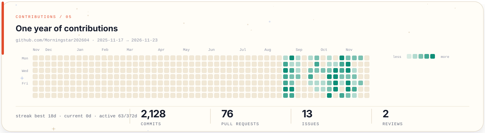

<b>English</b> · <a href="README.zh-CN.md">中文</a> · <a href="README.ja.md">日本語</a>

<picture><source media="(prefers-color-scheme: dark)" srcset="assets/hero-en-dark.svg" /></picture>

<picture><source media="(prefers-color-scheme: dark)" srcset="assets/starchart-en-dark.svg" /></picture>

A slow sky · one turn every minute

## 01 · Now

- **Personal repositories** — 27 · personal namespace, forks excluded
- **Upstream pull requests** — 6 selected: 5 merged, 1 open, 0 closed
- **Publishing** — CSDN archive; Juejin, Zhihu and Cnblogs automation

## 02 · Upstream pull requests

6 selected · 5 merged · 1 open · 0 closed · +282/−38 · 15 files · 34 comments

5 merged in 6.4d on average · fastest 1d

- [ohmyzsh/ohmyzsh#14140](https://github.com/ohmyzsh/ohmyzsh/pull/14140) — feat(core): add `omz diagnose` locale check · **open** · opened 2026-09-29 · +39/−0 · 2 files · 2 comments
- [PyCalendar/icalendar#1731](https://github.com/PyCalendar/icalendar/pull/1731) — docs: stop composing single_utc_property docstrings from the property name · **merged** · merged 2026-09-08 · +129/−16 · 4 files · 22 comments
- [PyCalendar/icalendar#1751](https://github.com/PyCalendar/icalendar/pull/1751) — Refactor TYPE_CHECKING imports to use public exports from icalendar.cal · **merged** · merged 2026-09-03 · +4/−4 · 4 files · 8 comments
- [ohmyzsh/ohmyzsh#14021](https://github.com/ohmyzsh/ohmyzsh/pull/14021) — fix(pipenv): keep activation and the project directory in sync · **merged** · merged 2026-09-05 · +12/−5 · 1 file · 1 comment
- [jaychouchannel/claude-tool-agent#34](https://github.com/jaychouchannel/claude-tool-agent/pull/34) — fix(frontend): 星号强调仅限单行配对，* 列表与行内代码不再被误吞 · **merged** · merged 2026-10-11 · +13/−8 · 1 file · 1 comment
- [jaychouchannel/claude-tool-agent#33](https://github.com/jaychouchannel/claude-tool-agent/pull/33) — fix(orchestrator): 修复回复开头 @ 导致的链式发言断链 · **merged** · merged 2026-08-29 · +85/−5 · 3 files · 0 comments

PR snapshot 2026-11-22 · GitHub Search / pulls API

## 03 · Featured projects

<a href="https://github.com/Morningstar202604/workbench"><picture><source media="(prefers-color-scheme: dark)" srcset="assets/project-0-en-dark.svg" /></picture></a> <a href="https://github.com/Morningstar202604/creator-studio"><picture><source media="(prefers-color-scheme: dark)" srcset="assets/project-1-en-dark.svg" /></picture></a>

<a href="https://github.com/Morningstar202604/digilegacy"><picture><source media="(prefers-color-scheme: dark)" srcset="assets/project-2-en-dark.svg" /></picture></a> <a href="https://github.com/Morningstar202604/harbor"><picture><source media="(prefers-color-scheme: dark)" srcset="assets/project-3-en-dark.svg" /></picture></a>

<a href="https://github.com/Morningstar202604/moneyhelper"><picture><source media="(prefers-color-scheme: dark)" srcset="assets/project-4-en-dark.svg" /></picture></a> <a href="https://github.com/Morningstar202604/sciflow"><picture><source media="(prefers-color-scheme: dark)" srcset="assets/project-5-en-dark.svg" /></picture></a>

More projects: [world-walker](https://github.com/Morningstar202604/world-walker) · [spark](https://github.com/Morningstar202604/spark)

## 04 · Numbers

<picture><source media="(prefers-color-scheme: dark)" srcset="assets/numbers-en-dark.svg" /></picture>

## 05 · Contribution calendar

<picture><source media="(prefers-color-scheme: dark)" srcset="assets/contrib-en-dark.svg" /></picture>

Exact daily contributions from the GitHub GraphQL snapshot · refreshed weekly

## 06 · Languages

<picture><source media="(prefers-color-scheme: dark)" srcset="assets/langs-en-dark.svg" /></picture>

## 07 · Publishing line

<a href="https://blog.csdn.net/weixin_56622231"><picture><source media="(prefers-color-scheme: dark)" srcset="assets/channel-csdn-en-dark.svg" /></picture></a> <a href="https://juejin.cn/user/2350111542479753/posts"><picture><source media="(prefers-color-scheme: dark)" srcset="assets/channel-juejin-en-dark.svg" /></picture></a>

<a href="https://www.zhihu.com/people/e7c851hd"><picture><source media="(prefers-color-scheme: dark)" srcset="assets/channel-zhihu-en-dark.svg" /></picture></a> <a href="https://www.cnblogs.com/badhope"><picture><source media="(prefers-color-scheme: dark)" srcset="assets/channel-cnblogs-en-dark.svg" /></picture></a>

Four publishing accounts: CSDN is archived by hand; Juejin, Zhihu and Cnblogs run on the automation line.

Latest on CSDN

- 2026-11-04 — [把 AI Agent 接进业务系统，我踩了 3 个挺蠢的坑](https://blog.csdn.net/weixin_56622231/article/details/170051167)
- 2026-10-18 — [Gemini 4 Argon 全面开放：谷歌憋了半年的旗舰大招，到底行不行？](https://blog.csdn.net/weixin_56622231/article/details/168251657)

<a href="https://blog.csdn.net/weixin_56622231">All posts on CSDN →</a>

One source, five profiles · numbers from a local snapshot

All public repositories: [github.com/Morningstar202604](https://github.com/Morningstar202604)
