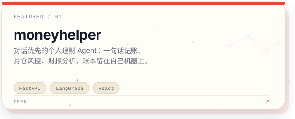
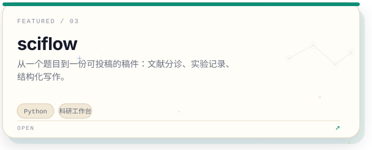
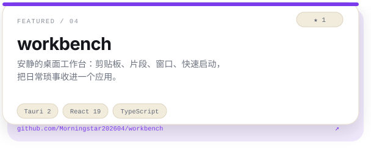
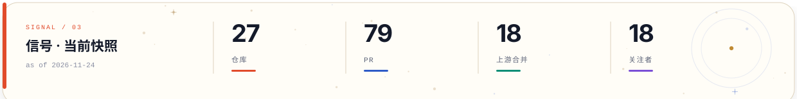
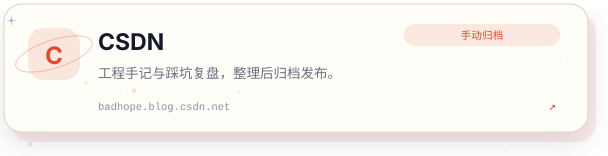

<a href="README.md">English</a> · <b>中文</b> · <a href="README.ja.md">日本語</a>

<picture><source media="(prefers-color-scheme: dark)" srcset="assets/hero-zh-CN-dark.svg" /></picture>

## 01 · 现在

- 长线养护 **moneyhelper**、**spark**、**sciflow**
- 把上游修复养住：ohmyzsh、icalendar、apache/airflow
- 写工程手记：Agent 与本地优先 AI

## 02 · 代表作品

<a href="https://github.com/Morningstar202604/moneyhelper"><picture><source media="(prefers-color-scheme: dark)" srcset="assets/work-1-zh-CN-dark.svg" /></picture></a> <a href="https://github.com/Morningstar202604/spark"><picture><source media="(prefers-color-scheme: dark)" srcset="assets/work-2-zh-CN-dark.svg" /></picture></a>

<a href="https://github.com/Morningstar202604/sciflow"><picture><source media="(prefers-color-scheme: dark)" srcset="assets/work-3-zh-CN-dark.svg" /></picture></a> <a href="https://github.com/Morningstar202604/workbench"><picture><source media="(prefers-color-scheme: dark)" srcset="assets/work-4-zh-CN-dark.svg" /></picture></a>

## 03 · 数据

<picture><source media="(prefers-color-scheme: dark)" srcset="assets/numbers-zh-CN-dark.svg" /></picture>

## 04 · 发布管线

<a href="https://blog.csdn.net/weixin_56622231"><picture><source media="(prefers-color-scheme: dark)" srcset="assets/channel-csdn-zh-CN-dark.svg" /></picture></a> <a href="https://juejin.cn/user/2350111542479753"><picture><source media="(prefers-color-scheme: dark)" srcset="assets/channel-juejin-zh-CN-dark.svg" /></picture></a>

- 2026-11-04 — [把 AI Agent 接进业务系统，我踩了 3 个挺蠢的坑](https://blog.csdn.net/weixin_56622231/article/details/170051167)
- 2026-10-18 — [Gemini 4 Argon 全面开放：谷歌憋了半年的旗舰大招，到底行不行？](https://blog.csdn.net/weixin_56622231/article/details/168251657)

<a href="https://blog.csdn.net/weixin_56622231">CSDN 全部文章 →</a>

## 05 · 架子上还有

> [sciflow](https://github.com/Morningstar202604/sciflow) · [world-walker](https://github.com/Morningstar202604/world-walker) · [digilegacy](https://github.com/Morningstar202604/digilegacy) · [harbor](https://github.com/Morningstar202604/harbor) · [creator-studio](https://github.com/Morningstar202604/creator-studio)

Upstream: [ohmyzsh](https://github.com/ohmyzsh/ohmyzsh) · [icalendar](https://github.com/python-icalendar/icalendar) · [apache/airflow](https://github.com/apache/airflow) · [renovate-operator](https://github.com/mogenius/renovate-operator)

One source, five profiles · numbers from a local snapshot

全部仓库: [github.com/Morningstar202604](https://github.com/Morningstar202604)
