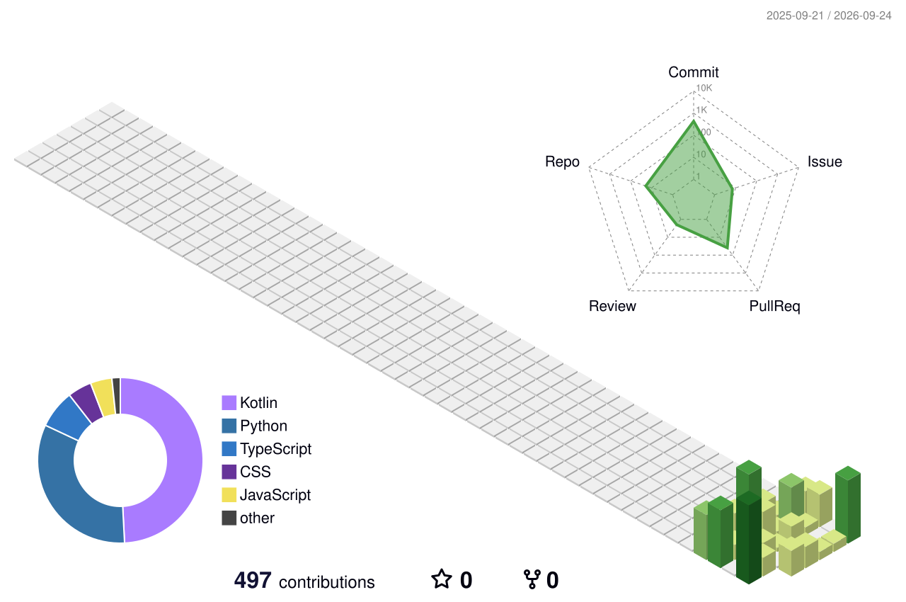

[English](README.md) | [中文](README.zh.md) | [日本語](README.ja.md)

  

  

## 关于

一名把抽象想法落地为可交互界面的开发者。专注全栈与创意工具，偏爱简洁、有质感的设计，反感千篇一律的模板。代码与星空同理，精巧之处藏在细节里。

- **近期在折腾**：交互可视化、自动化工作流、能让人会心一笑的小工具
- **常用语言**：TypeScript / Python / Rust

## 统计

<!-- STATS:START -->
- ⭐ **36** stars &nbsp;·&nbsp; 👥 **6** followers &nbsp;·&nbsp; 📦 **47** repositories
<!-- STATS:END -->

  

## 连续提交

  

## 贡献热力图

  

  

## 技术栈

  

## 项目

<!-- PROJECTS:START -->
- **[ScholarSeed](https://github.com/Morningstar202604/ScholarSeed)** · 2★ · Python · 2026-08-29
- **[AgentSeed](https://github.com/Morningstar202604/AgentSeed)** · 4★ · Python · 2026-08-29
- **[mashang-python](https://github.com/Morningstar202604/mashang-python)** · 2★ · Kotlin · 2026-08-29
- **[fogsea-survival](https://github.com/Morningstar202604/fogsea-survival)** · TypeScript · 2026-08-29
- **[FinHub](https://github.com/Morningstar202604/FinHub)** · Python · 2026-08-29
- **[scholarhub](https://github.com/Morningstar202604/scholarhub)** · Python · 2026-08-29
<!-- PROJECTS:END -->

## 博客

<!-- BLOG:START -->
- [深度学习入门完全指南：从零开始，看懂、学会、用起来](https://blog.csdn.net/weixin_56622231/article/details/164154831) · `2026-08-29` · CSDN
- [AI为什么会代替人类？如果那一天来了，我们何去何从](https://www.cnblogs.com/badhope/p/22758085/ai-replace-humans-where-to-go-2026) · `2026-08-29` · 博客园
- [AI为什么会代替人类？如果那一天真的来了，我们何去何从](https://www.cnblogs.com/badhope/p/22758074/ai-replace-humans-where-to-go) · `2026-08-29` · 博客园
- [具身智能2026：AI长出了身体，VLA模型让人形机器人从实验室走进工厂](https://www.cnblogs.com/badhope/p/22757599/embodied-ai-2026-vla-humanoid-robots) · `2026-08-29` · 博客园
- [Pi Agent：9.8万Star，只有4个工具却干翻一切，AI编程界的极简主义革命](https://www.cnblogs.com/badhope/p/22757597/pi-agent-98k-stars-4-tools-minimalist-revolution) · `2026-08-29` · 博客园
- [AgentSeed：给AI编程Agent装一道防幻觉门控，实测有效](https://www.cnblogs.com/badhope/p/22747733/agentseed-anti-hallucination-gate) · `2026-08-28` · 博客园
<!-- BLOG:END -->

## 开源雷达

  值得关注的工具和框架。

  
  
  
  
   
  
  
  
  
   
  
  
  
  

## 在别处

  
  
  
  
  
  

  

  &copy; Morningstar202604

## 镜像

本主页主要托管在 **GitHub**，并镜像至 GitCode 和 Gitee。

| 平台 | 链接 |
|------|------|
| **GitHub**（主站） | https://github.com/Morningstar202604 |
| GitCode（镜像） | https://gitcode.com/badhope/badhope |
| Gitee（镜像） | https://gitee.com/badhope/badhope |

> 内容跨平台手动同步，GitHub 为权威来源。
